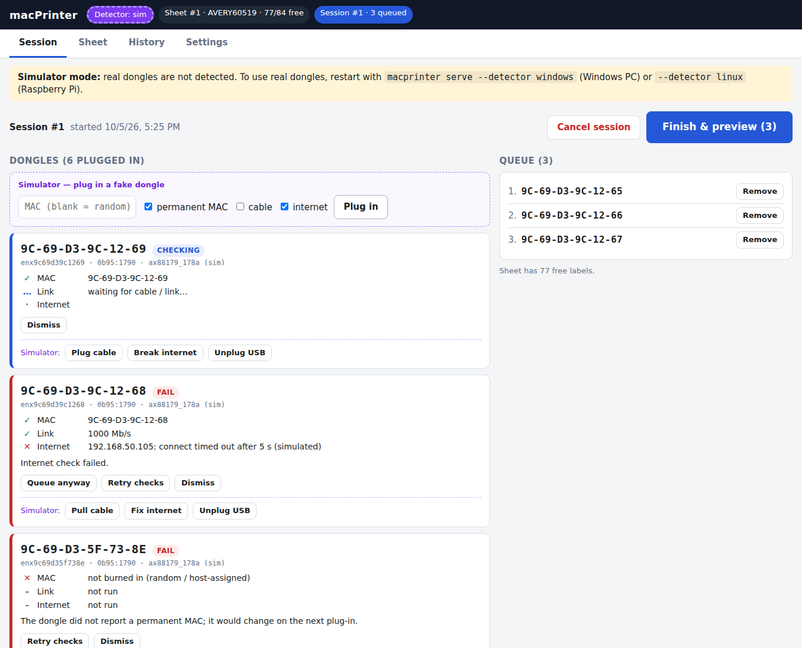

# macPrinter

Kiosk that reads the MAC address of a USB-Ethernet dongle, checks the dongle works
(Ethernet link + internet through it), and lays out QR + text labels onto partially
used label sheets: **Avery PermaTrack 60519** (1" × ½", 84/sheet) by default, or
OnlineLabels OL25SP. Pick the stock when loading a new sheet (Sheet tab). See [DESIGN.md](DESIGN.md) for requirements, decisions, and open questions.

**Status:** dashboard, simulated dongles, checks, sheet tracking, and PDF preview work.
Printing is **not** connected. "Mark as printed" records the job and uses up the sheet positions.
The Linux (Pi) and Windows dongle detectors are written but not yet tried on real hardware.



## Run it on your machine (Windows, macOS, or Linux)

Needs Python 3.11+.

```sh
git clone https://github.com/leftoverjacksons/macPrinter.git && cd macPrinter
python -m venv .venv
# Windows:      .venv\Scripts\activate
# macOS/Linux:  source .venv/bin/activate
pip install -e ".[dev]"
macprinter serve
```

Open <http://localhost:8000>. It starts with the **simulator**: plug in fake dongles from
the dashboard (random or chosen MAC, with or without a permanent MAC, cable, or internet)
to exercise the whole flow. Data lives in `./data/` (SQLite + job PDFs); delete it to start over.

Real dongles:

| Where | Command | Notes |
|-------|---------|-------|
| Windows PC | `macprinter serve --detector windows` | Experimental. Uses PowerShell `Get-NetAdapter`; labels the adapter's *permanent* address |
| Raspberry Pi / Linux | `macprinter serve --detector linux` | Needs the network setup in [deploy/README.md](deploy/README.md) for the link/internet checks |

## The workflow

1. **Start session.**
2. Plug in a dongle **with an Ethernet cable connected to a network that has DHCP and internet**.
   Each dongle is checked:
   - **MAC**: valid, burned into the dongle (not random), not already labeled.
   - **Link**: Ethernet link comes up; speed reported (warns below 1000 Mb/s).
   - **Internet**: gets a DHCP address, then fetches Google's connectivity check
     (`connectivitycheck.gstatic.com/generate_204`) *through that dongle*.
3. Passing dongles are queued. Failures show why, with **Retry**, and **Queue anyway**
   where an override makes sense.
4. **Finish & preview**: shows where each label goes on the current sheet and the exact PDF.
5. **Mark as printed**: records the labels and uses up those positions. If the queue
   doesn't fit, the rest stay queued for the next sheet.

Checks can be turned off or tuned in **Settings**. The **Sheet** tab shows every label position;
tap one to mark it used or void to match the physical sheet. **History** lists every labeled
MAC with reprint and CSV export.

## Command-line rendering

```sh
macprinter align -o alignment.pdf          # plain-paper alignment/calibration page
macprinter sheet --mac 9C-69-D3-9C-12-65 --used 0,0 --used 0,1 -o sheet.pdf
macprinter --template OL25SP align -o ol25-alignment.pdf   # other stock
```

Calibration: print `alignment.pdf` at 100 % scale (no fit-to-page) on plain paper, lay it on
a label sheet against a light, measure the offset, and enter it in **Settings → Printer calibration**.


## Deploy to the Raspberry Pi

Same code, `--detector linux`. See [deploy/README.md](deploy/README.md) (systemd service,
NetworkManager profile for dongles under test, kiosk browser).

## Tests

```sh
pytest
```

## Check a dongle by hand (Linux)

```sh
sudo tools/mac_probe.sh     # MAC, whether it's permanent, USB IDs, EEPROM dump
```
